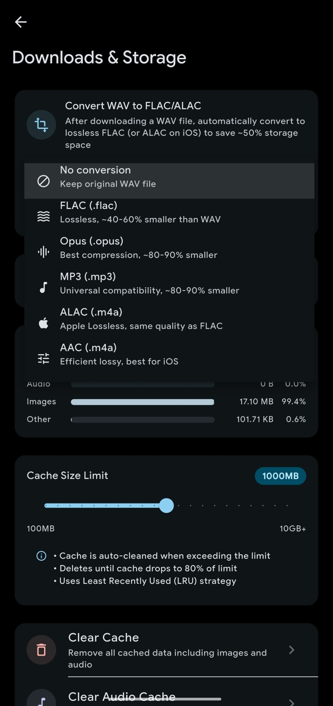

<div align="center">
  

  # KikoFlu Edge

  A cross-platform doujin voice client. Supports self-hosted Kikoeru servers and online services.
  I just tested it for Android, I don't know if Windows/Linux/MacOS can run smoothly without bugs or not

  [](https://flutter.dev)
  [](#)
  [](LICENSE)


</div>

<div align="center">
  
  
  
  
</div>

## Features

### 🎵 Media Playback
- Background playback with automatic caching
- Playback speed control
- Loop (single / list) and shuffle modes
- **Queue management** — reorder, skip, and manage your play queue
- **Fullscreen player** — immersive playback UI with enhanced controls
- Multi-format support: audio, video, text, images, PDF, etc.
- Full or selective download with concurrent download management
- Offline download search and sorting
- **Playback history** — track and revisit recently played works
- **Hi-res audio output** — high-resolution audio support
- **Exclusive audio mode** — bit-perfect audio output
- **Equalizer** — built-in equalizer with presets
- **Replay gain** — consistent volume across tracks
- **Volume normalization** — automatic volume leveling
- **Streaming speed tracker** — real-time buffering and streaming stats
- **MPV player integration** — configurable MPV backend

### 📝 Subtitle System
- Automatic subtitle loading
- Subtitle import, editing, and timing adjustment
- Real-time subtitle / lyric translation during playback
- **LLM-powered translation** — AI-assisted subtitle and lyric translation
- Subtitle library (SQLite indexed, fast search)
- **Custom file picker** — import subtitle folders with the built-in CustomFilePicker (breadcrumb nav, quick access, search, hidden files toggle)
- Custom save directory with cross-drive copy support

### 📥 Downloads
- **Redesigned Downloads screen** — source tab layout (server / offline)
- **Count badges** on source tabs showing item totals
- **Filter bar** — filter downloads by circle, VA, and tag
- **Colored circle avatars** — visual distinction per download source
- **Separate import button row** — cleaner top bar layout
- **Sort by title, added time, and file tree** — multiple sorting options
- **Cover image auto-resize** during import to prevent player failures

### 📋 Playlists & Smart Playlists
- **Queue management** — full queue UI with reorder and skip controls
- **Smart playlists** — auto-generated playlists based on custom rules:
  - By tag, VA (voice actor), circle
  - By age (release date range)
  - By rating threshold
  - By subtitle presence
- **Smart playlist evaluator** — dynamically updates content as your library grows
- **Playlist UI/UX enhancements** — improved playlist browsing and management

### 📊 Listening Statistics
- **Comprehensive statistics dashboard** — track your listening habits
- Total listening time, works completed, trends over time
- Listening history breakdown
- **Redesigned stats UI** — beautiful visual presentation with charts

### 🎨 Interface
- Full platform support (Android / iOS / Windows / macOS / Linux)
- Material Design 3
- Landscape mode support
- Light and dark theme
- Title, file directory, and text file translation
- Automatic tag translation (Chinese / English / Japanese)
- **Privacy mode** — blur sensitive content
- Rating system
- Recommendations
- **Home screen widget (Android)** — current track info and playback controls on your home screen

### 🔍 Search
- Advanced search with multi-tag / exclude-tag support
- Multi-dimensional filtering (tags, rating, release date, etc.)
- Detailed work information display

### 📁 Custom File Manager
- **Built-in CustomFilePicker** — replaces system file picker (SAF) for better compatibility
- **Breadcrumb navigation** — easy folder traversal
- **Quick access sidebar** — shortcuts to common locations
- **Search functionality** — find files and folders quickly
- **Show/hide hidden files** toggle
- **MIUI compatibility** — works reliably on Xiaomi devices

### 🌐 Internationalization
- 简体中文 / 繁體中文 / English / 日本語 / Русский

### ⚙️ Settings
- Multi-account support
- Custom server address ([Guide](https://github.com/pa-jesusf/KikoFlu/wiki/%E4%BD%BF%E7%94%A8%E8%87%AA%E5%BB%BA%E5%90%8E%E7%AB%AF%E6%9C%8D%E5%8A%A1%E5%99%A8)) with connection latency testing
- **Custom cookie support** — for server authentication
- Cache size limit and cleanup strategy
- Theme and color scheme customization
- Extensive UI customization options
- Audio output configuration (hi-res, exclusive mode, equalizer, replay gain, normalization)
- MPV player configuration
- **Progress sync** — sync playback progress across devices
- **Screen state management** — keep screen on during playback
- In-app log system (with export)
- Update checker

### 📱 Android Features
- Floating lyrics (lock / unlock / touch passthrough)
- **Home screen widget** — quick playback controls and now-playing info
- **Exclusive audio mode** — bit-perfect USB DAC support *maybe some devices support need android 14+, failed on my poco x6 5g.. but you can try by yourself :)

---

## Download

Go to [Releases](https://github.com/pa-jesusf/KikoFlu/releases/latest) for the latest version.

Platforms: Android (universal / arm64 / armeabi-v7a / x86_64), iOS (unsigned IPA), Windows (installer / portable), macOS (DMG), Linux (x64 / arm64)

### AltStore / SideStore

iOS users can add the KikoFlu Edge source to AltStore or SideStore for easy installation and updates:

**Source URL:** `https://raw.githubusercontent.com/pa-jesusf/KikoFlu/main/altstore-source.json`

---

## Build from Source

### Requirements
- Flutter SDK 3.0+
- Dart SDK 3.0+

```bash
git clone https://github.com/pa-jesusf/KikoFlu.git
cd KikoFlu
flutter pub get
```

### Build Commands

| Platform | Command |
|----------|---------|
| Android | `flutter build apk --release --split-per-abi` |
| Windows | `flutter build windows --release` |
| macOS | `flutter build macos --release` |
| Linux | `flutter build linux --release` |
| iOS | `./build_ios_xcode.sh` |

---

## Related Projects

- [Kikoeru](https://github.com/Number178/kikoeru-express) — Self-hosted backend server
- [asmr.one](https://www.asmr.one) — Online service

## Contributors

- **Meteor-Sage** — Original author & lead developer

## License

[GPL-3.0 License](LICENSE)

## Contact

- **Bug Reports**: [Issues](https://github.com/pa-jesusf/KikoFlu/issues)
- **Community**: [Telegram](https://t.me/+PrkiN-pZrXs4ZTU1)

---

<div align="center">

  **If this project helps you, please give it a ⭐ Star!**

</div>
