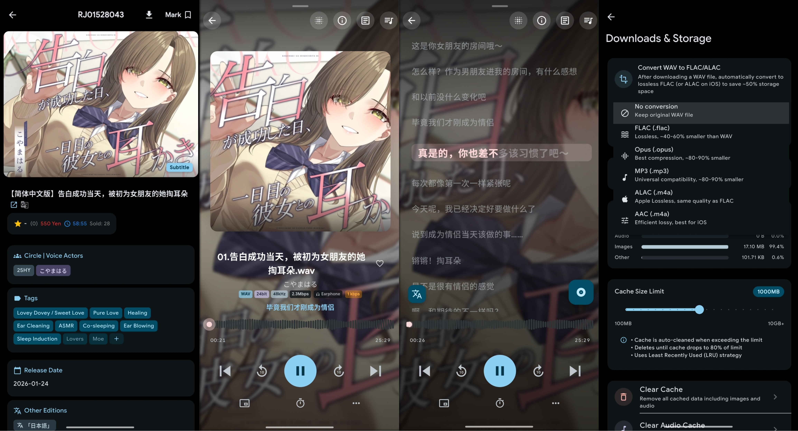

<div align="center">
  

  # KikoFlu

  A cross-platform doujin voice client for self-hosted Kikoeru servers and online services.
  Built with Flutter — supports Android, Windows, macOS, Linux, iOS.

  [](https://flutter.dev)
  [](#)
  [](LICENSE)

</div>

<div align="center">
  
</div>

## Features

- 🎵 **Media Playback** — Background play, queue management, fullscreen player, speed control, loop/shuffle
- 🔊 **Hi-Res & USB DAC** — Bit-perfect audio output via AAudio exclusive mode & libusb (decent-player)
- 🎛️ **Equalizer & Replay Gain** — Built-in EQ with presets, automatic volume normalization
- 🤖 **AI Transcription** — On-device Whisper.cpp, batch transcription, auto LRC generation
- 📝 **Subtitle System** — Import, edit, sync, real-time translation with LLM support
- 📥 **Downloads** — Full/selective download, offline browsing, filter by circle/VA/tag
- 📋 **Smart Playlists** — Auto-generated playlists by tag, VA, rating, release date, subtitle presence
- 📊 **Listening Stats** — Comprehensive dashboard with trends and history breakdown
- 🔍 **Advanced Search** — Multi-tag/exclude-tag filtering with multi-dimensional sorting
- 📁 **Custom File Picker** — Built-in file manager with breadcrumb nav, search, hidden files toggle
- 🌐 **i18n** — 简体中文 / 繁體中文 / English / 日本語 / Русский
- 📱 **Android** — Floating lyrics, home screen widget, keep-screen-on, progress sync

## Download

Get the latest build from [Releases](https://github.com/Rikunss/KikoFlu/releases/latest).

## Build from Source

### Requirements
- Flutter SDK 3.0+ & Dart SDK 3.0+

```bash
git clone https://github.com/Rikunss/KikoFlu.git
cd KikoFlu
flutter pub get
```

### Build Commands

| Platform | Command |
|----------|---------|
| Android  | `flutter build apk --release --split-per-abi` |
| Windows  | `flutter build windows --release` |
| macOS    | `flutter build macos --release` |
| Linux    | `flutter build linux --release` |
| iOS      | `./build_ios_xcode.sh` |

## Credits

- **[decent-player](https://github.com/Ma145/decent-player)** — Bit-perfect USB DAC audio output via libusb (open source)
- **[Kikoeru](https://github.com/Number178/kikoeru-express)** — Self-hosted backend server
- **[asmr.one](https://www.asmr.one)** — Online service

### Contributors

- **Meteor-Sage** — Original author & lead developer
- **Rikunss** — Maintainer

## License

[GPL-3.0 License](LICENSE)

## Contact

- **Issues**: [GitHub Issues](https://github.com/Rikunss/KikoFlu/issues)
- **Community**: [Telegram](https://t.me/+PrkiN-pZrXs4ZTU1)
